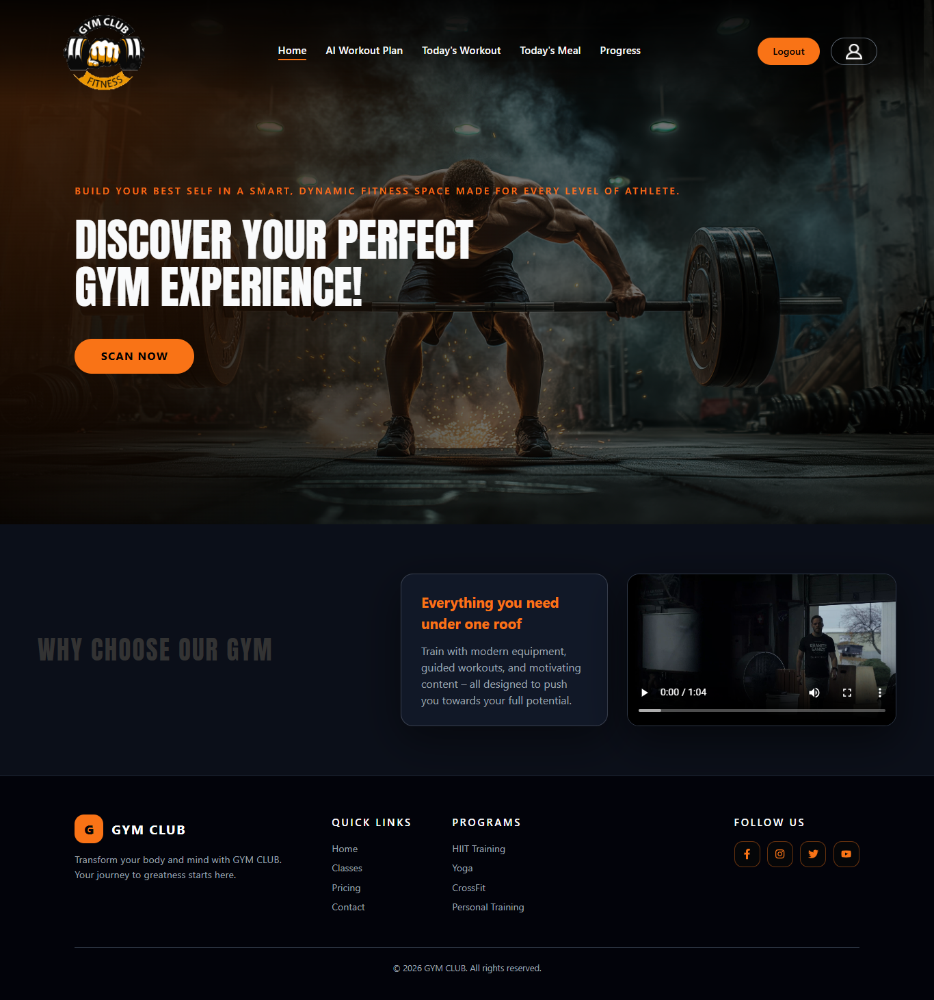
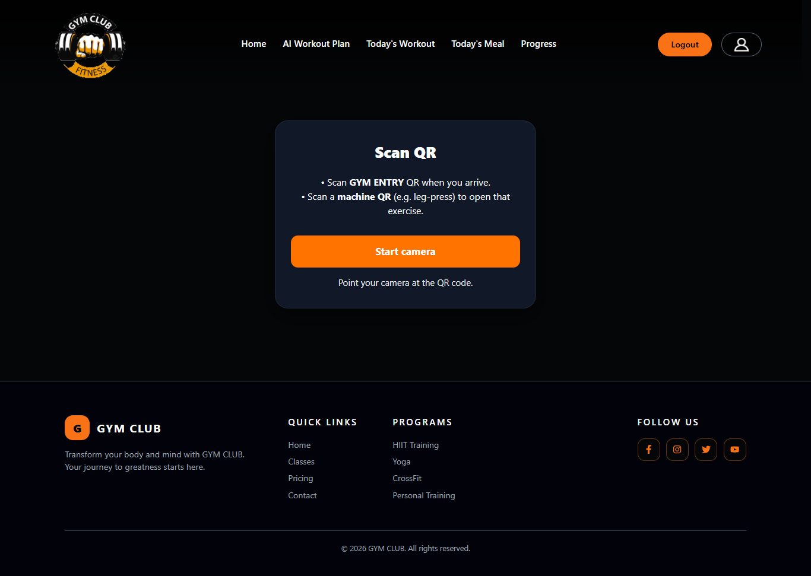

🏋️‍♂️ FYP – AI-Powered Gym Management System

An intelligent full-stack gym management platform that combines AI-powered workout planning, machine tracking with QR codes, and fitness analytics to deliver a modern gym experience.

🚀 Features

🤖 AI Workout Planner
Generate personalized workout plans using AI (Clarifai / OpenAI-compatible API)

🏷️ Machine Management with QR Codes
Each machine has a unique QR code that links to its details and workouts

📊 Workout Tracking System
Track workouts, sets, reps, and progress over time

🔐 Authentication System
Secure login/register using JWT authentication

📈 Fitness Metrics
Store and analyze user fitness data

🎯 Workout Programs
Structured training programs with daily progression

🌐 RESTful API
Clean and scalable backend architecture

🛠️ Tech Stack
Backend

Laravel (PHP)

MySQL

JWT Authentication

REST API

QR Code Generation (SimpleSoftwareIO)

AI Integration

Clarifai API (OpenAI-compatible models)

Frontend

React.js (Vite)

Axios

📂 Project Structure
backend/
├── app/
├── routes/
├── database/
├── public/
├── storage/
└── .env.example

frontend/
├── src/
├── public/
├── package.json
└── .env.example
⚙️ Installation & Setup
🔹 1. Clone the repository
git clone https://github.com/CharbelWehbe/gym-ai-backend.git
cd gym-ai-backend
🔹 2. Install backend dependencies
composer install
🔹 3. Setup environment
cp .env.example .env

Then configure your .env file.

🔹 4. Generate application key
php artisan key:generate
🔹 5. Run migrations
php artisan migrate
🔹 6. Start the server
php artisan serve
🔑 Environment Variables

Important variables you need to configure in .env:

APP_NAME=
APP_URL=

DB_DATABASE=
DB_USERNAME=
DB_PASSWORD=

CLARIFAI_PAT=
JWT_SECRET=

👉 Use .env.example as a reference.

🔗 API Endpoints
🔐 Auth

POST /auth/register

POST /auth/login

GET /auth/me

POST /auth/logout

🏋️ Machines

GET /machines

GET /machines/{id}

POST /machines

POST /machines/{id}/generate-qr

🤖 AI

POST /ai/workout-plan

📊 Workouts & Metrics

POST /workout-programs/{id}/start

GET /fitness-metrics

POST /fitness-metrics

🖼️ QR Code Feature

Each machine generates a QR code that:

Encodes the machine name

Links to machine details

Can be scanned via mobile devices or drop the svg file created inside Public/Qr file when you post a new machine

👥 Contributors

👨‍💻 Charbel Wehbe

👨‍💻 Manuel Mallo

📸 Screenshots
### LandinPage

### Generate A Plan Page

### Today's Workout Page

### ScanQr

🎯 Future Improvements

📱 Mobile app (React Native)

🧠 Improved AI recommendations

📊 Advanced analytics dashboard

☁️ Cloud deployment (AWS / DigitalOcean)

📄 License

This project is for educational purposes.